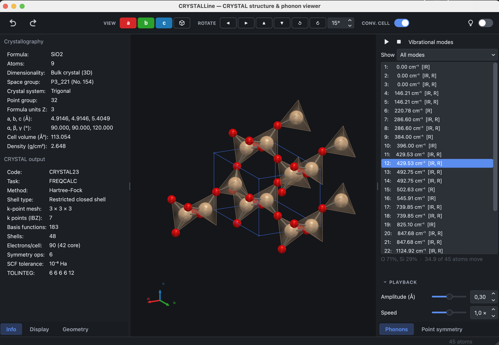

<p align="center">
  
</p>

<p align="center">
  A program to build, display and manipulate the structures used by the
  <b>CRYSTAL</b> quantum-chemistry code, to animate the vibrational modes
  computed from them, and to plot the properties a calculation returns.
</p>

<p align="center">
  <a href="https://crystaldevs.github.io/CRYSTALLine/"><b>Documentation</b></a>
</p>

<p align="center">
  
  
  
  
  
</p>

CRYSTALLine is in beta. Errors are to be expected, and bug reports, suggestions,
comments and requests for new features are all welcome.

## Installation

Python 3.11 or newer, in an environment of its own:

```sh
conda create --name crystal python=3.12 && conda activate crystal
pip install CRYSTALLine
crystalline
```

If it does not start, `crystalline --check` reports what is missing. See the
[installation page](https://crystaldevs.github.io/CRYSTALLine/install.html).

## What it does

- Displays crystals, slabs, polymers and molecules in an interactive 3D view,
  with their crystallography beside them — space group or layer group, lattice
  parameters, density — recomputed as the structure is edited.
- Reads the vibrational modes from a CRYSTAL output and animates them, at Γ and
  at the q points of a dispersion calculation, with export to GIF, MP4 and more.
- Edits structures: atoms, elements, cells, supercells, and the symmetry itself.
- Writes CRYSTAL (`.d12`) and properties (`.d3`) input decks from the structure
  on screen, with the band path chosen on the Brillouin zone.
- Plots what comes back: electronic bands and densities of states, IR and Raman
  spectra, elastic properties, equations of state, phonon bands, XRD.

The [documentation](https://crystaldevs.github.io/CRYSTALLine/) describes each
of these in turn.

<p align="center">
  
</p>

## License

[GNU General Public License v3.0 or later](LICENSE).

## Acknowledgements

Built on the [CRYSTALClear](https://github.com/crystaldevs/CRYSTALClear) I/O and
plotting framework for the [CRYSTAL](https://www.crystal.unito.it/) code, and
following in the tradition of [MOLDRAW](https://www.moldraw.unito.it/), written
by Prof. Piero Ugliengo.

Developed with the assistance of
[Claude](https://www.anthropic.com/claude) (Anthropic), using
[Claude Code](https://www.claude.com/product/claude-code).

## Contact

- Website: https://www.crystal.unito.it
- Email: crystalunito@gmail.com
- Instagram: [@crystaldevs](https://www.instagram.com/crystaldevs/)
