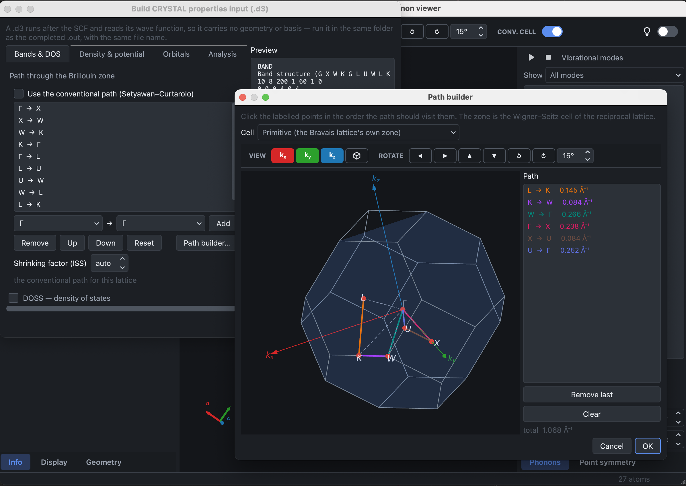

# Band paths and the Brillouin zone

A band path is used both by the properties deck, which computes electronic
bands with `BAND`, and by the frequency deck, which computes phonon bands with
`BANDS` within `FREQCALC`. The same editor serves both.

## Defining a path

The **conventional path** of the Bravais lattice is proposed by default. It is
derived from the lattice, so it follows the cell if the structure is changed.

The path can also be edited directly: segments are added, removed and
reordered, and the ends of a segment are given either as a label (`X`) or as
coordinates (`1/2 1/4 3/4`).

The third method is to define it on the Brillouin zone itself, with the **Path
builder**:

The special points of the lattice are drawn and labelled, and are selected in
the order in which the path visits them. Each segment is given a colour, which
is repeated in the list beside the view, and its length in Å⁻¹ is reported;
this length determines how the requested k points are distributed along the
path. The zone can be viewed along **k**x, **k**y or
**k**z, rotated by a fixed step, and exported as an image.

**Cell → Brillouin zone…** shows the same zone without selecting a path, for
either the primitive or the crystallographic cell.

## The shrinking factor

CRYSTAL reads the ends of each segment as integers divided by a shrinking
factor: `4 0 4` denotes X only when the factor is 8. The editor stores the
coordinates as fractions and converts them when the deck is written, so that
changing the factor rescales the integers instead of redefining the points.

With `auto`, the smallest factor which makes every coordinate integral is used;
any multiple of it is also accepted. A factor which would leave a coordinate
fractional is refused.

## Special points

The labels and the coordinates of the special points are those recognised by
CRYSTAL, given in tables 14.1 and 14.2 of its manual. They coincide with the
tables in common use for the cubic lattices, for the hexagonal lattice, and for
the primitive tetragonal and the primitive and face-centred orthorhombic
lattices, and differ for others:

- P of the body-centred tetragonal lattice is (½,½,½) for CRYSTAL and (¼,¼,¼)
  in the other tables;
- Y and Z of the primitive monoclinic lattice are interchanged;
- Y and M of the base-centred monoclinic lattice likewise.

A label which denotes one point in the program that writes the file and another
in the program that reads it produces a band structure of a different path, so
only the labels recognised by CRYSTAL are written into a deck.

A point is identified up to the symmetry of the lattice. The CRYSTAL tutorial
writes M of the hexagonal lattice as (0,½,0) where the tables give (½,0,0);
both denote the same point, and both are recognised.

## Lattices whose conventional path cannot be written

For seven of the fourteen Bravais lattices — rhombohedral, body-centred
tetragonal, the three centred orthorhombic lattices and the two monoclinic
ones — the conventional path passes through points whose coordinates depend on
the lattice parameters, and no shrinking factor represents them exactly. Two of
the five plane lattices, the oblique and the centred rectangular, are in the
same position.

For these the proposed path runs from Γ to each of the special points that
CRYSTAL names, all of which are simple fractions. The editor reports that this
is what is being offered. Any other path can be defined with the path builder.

## Slabs

The Brillouin zone of a slab is a polygon, constructed from the two periodic
directions alone, and carries no **k**z. Its special points are those
of the corresponding plane lattice, and every path lies in the plane.
