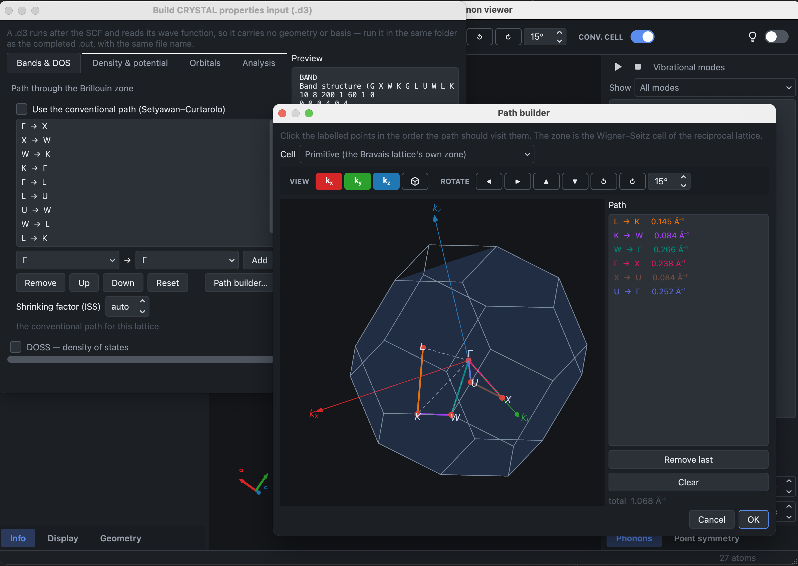

# Band paths and the Brillouin zone

A band path is used both by the properties deck, which computes electronic
bands with `BAND`, and by the frequency deck, which computes phonon bands with
`BANDS` within `FREQCALC`. The same editor serves both.

## Defining a path

The **conventional path** of the Bravais lattice is proposed by default adopting 
the Setyawan-Curtarolo convention. It is derived from the lattice, so it 
follows the cell if the structure is changed.

The path can also be edited directly: segments are added, removed and
reordered, and the ends of a segment are given either as a label (`X`) or as
coordinates (`1/2 1/4 3/4`).

The path follows the periodicity of the structure, not the three vectors it is
written with: a slab is given the path of its plane lattice, and a polymer the
only path a one-dimensional zone has, Γ to X.

A third method consists in defining it on the Brillouin zone itself, with the 
**Path builder**:



The special points of the lattice are drawn and labelled, and are selected in
the order in which the path visits them. Each segment is given a colour, which
is repeated in the list beside the view, and its length in Å⁻¹ is reported;
this length determines how the requested k points are distributed along the
path. The zone can be viewed along **k**<sub>x</sub>, **k**<sub>y</sub> or
**k**<sub>z</sub>, rotated by a fixed step, and exported as an image.

**Cell → Brillouin zone…** shows the same zone without selecting a path, for
either the primitive or the crystallographic cell.

## The shrinking factor

CRYSTAL reads the ends of each segment as integers divided by a shrinking
factor: `4 0 4` denotes X only when the factor is 8. The editor stores the
coordinates as fractions and converts them when the deck is written, so that
changing the factor rescales the integers instead of redefining the points.

With `auto`, the smallest factor which makes every coordinate integral is used;
any multiple of it is also accepted. A factor which would leave a coordinate
fractional is refused.

For seven of the fourteen Bravais lattices (rhombohedral, body-centred
tetragonal, the three centred orthorhombic lattices and the two monoclinic
ones) the conventional path passes through points whose coordinates depend on
the lattice parameters, and no shrinking factor represents them exactly. Two of
the five plane lattices, the oblique and the centred rectangular, are in the
same position. For these the proposed path runs from Γ to each of the special 
points that CRYSTAL names, all of which are simple fractions. The editor reports 
that this is what is being offered. Any other path can be defined with the path 
builder.

## Slabs

The Brillouin zone of a slab is a polygon, constructed from the two periodic
directions alone, and carries no **k**<sub>z</sub>. Its special points are those
of the corresponding plane lattice, and every path lies in the plane.

## Polymers

A one-dimensional zone is a segment. It has two points, Γ at its centre and X
at its end, and therefore one path only, Γ to X, which is what is proposed.
Written over a shrinking factor of 2, the deck reads:

```text
BAND
Band structure (G X)
1 2 200 1 34 1 0
0 0 0 1 0 0
```

The **Path builder** draws that segment, from −b/2 to +b/2 with Γ at its centre
and X at each end, built from the one direction that repeats. Drawn from all
three vectors it would be a needle a five-hundredth of an inverse ångström
across: the width of the vacuum CRYSTAL writes around the chain, and nothing
about the crystal.

The symmetry of a polymer is a rod group, which is not named here; see
[Symmetry](symmetry.md#the-info-panel).
