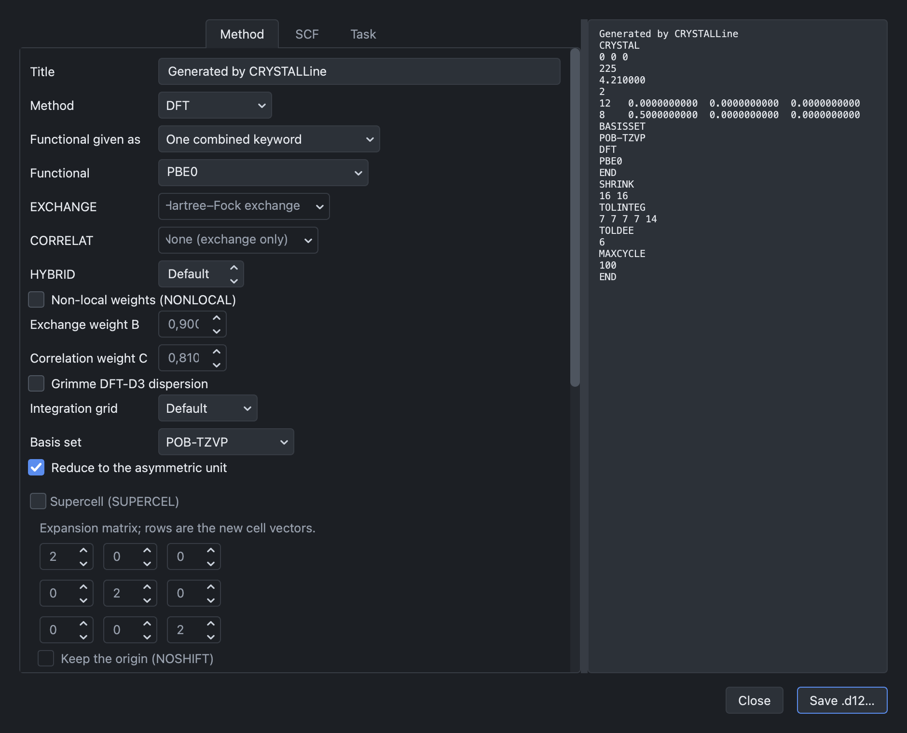
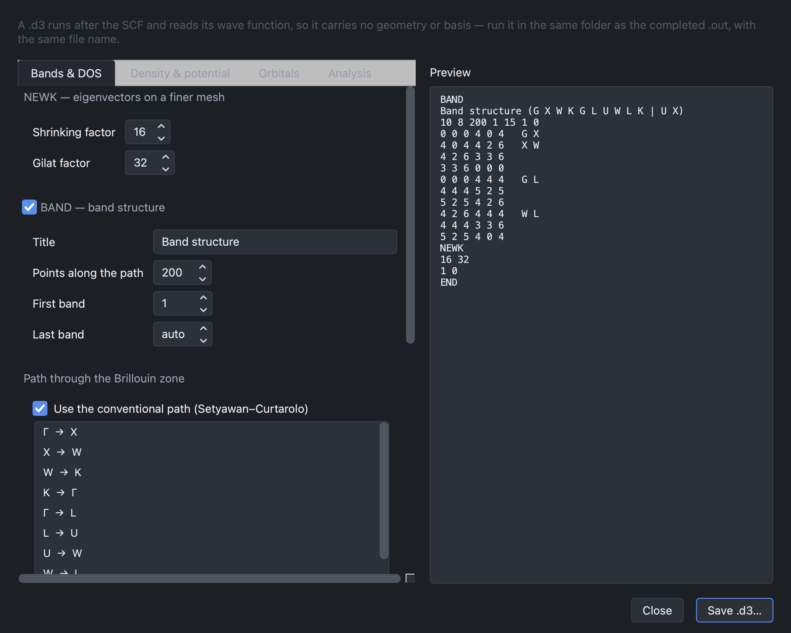

# CRYSTAL input builder

Two decks can be written from the structure on screen:

- **File → Build CRYSTAL input (.d12)…** — the calculation.
- **File → Build PROPERTIES input (.d3)…** — the analysis of the wave function
  that follows it.

Both show the text of the file as it will be written.

:::{div} crystal-shot

:::

## The geometry block

The geometry is derived from the structure:

| Structure | Keyword |
| --- | --- |
| crystal | `CRYSTAL` — space group and asymmetric unit |
| slab | `SLAB` — [layer group](symmetry.md#slabs) and asymmetric unit |
| polymer | `POLYMER` |
| molecule | `MOLECULE` |

Only the lattice parameters left free by the group are written — a hexagonal
layer group requires *a* alone — and only the symmetry-inequivalent atoms. When
the symmetry cannot be determined, the deck is written in group 1 with all
atoms listed.

A [reduced symmetry](symmetry.md#reducing-the-symmetry), if one has been
chosen, is used here.

## The calculation

The method (Hartree–Fock, or DFT with a single keyword or with separate
exchange and correlation functionals), the basis set and the SCF parameters are
selected in the dialog, together with the type of calculation: single point,
geometry optimisation, frequencies with infrared and Raman intensities, phonon
dispersion, quasi-harmonic approximation, equation of state, elastic constants,
coupled-perturbed Hartree–Fock, anharmonic calculations and spin–orbit
coupling.

Phonon band structures belong to this deck (`BANDS` within `FREQCALC`) and use
the path editor described in [Band paths](band-paths.md).

## The PROPERTIES deck

:::{div} crystal-shot

:::

The dialog writes `NEWK`, `BAND`, `DOSS`, `COOP` and `COHP`, `LOCALI` and
`ORBITALS`, `ECH3` and `POT3`, `EMDL`, `XRDSPEC`, `PATO` and `PPAN`; further
keywords can be added as free text.

Two points are handled by the program. The keywords are written in the order
required by the manual, `BAND` – `NEWK` – `DOSS`, since `NEWK` placed before
`BAND` stops the run. And the band path is written as integers over a shrinking
factor: a factor which would leave a coordinate fractional is refused rather
than rounded, so that the path contains the points intended.

### Charge density and electrostatic potential on a grid

The **Density & potential** tab writes `ECH3`, the electron charge density (and
the spin density, for an open-shell wave function), and `POT3`, the electrostatic
potential, both sampled on a three-dimensional grid (manual §14.8 and §14.14).

- **Points along a** is the number of grid points along the first lattice
  vector; the points along the other two are spaced to match.
- **Tolerance (ITOL)** is the penetration tolerance of `POT3`; 5 is the value
  the manual suggests.

For a crystal the grid spans the primitive cell, and nothing more is needed. A
slab, a polymer or a molecule has directions the cell does not bound, and the
manual requires the deck to say how far to sample along each of them. The
**Grid extent along the open directions** group appears for those systems only,
and offers the two forms the manual allows:

- **Scale the atoms' own extent** writes `SCALE`: the extent of the atomic
  coordinates along each open direction, multiplied by the factor given.
- **Explicit range** writes `RANGE`: the lower and upper bounds, in bohr.

The record is written once for each open direction — one for a slab, two for a
polymer, three for a molecule. It is shared by `ECH3` and `POT3`: to paint the
potential onto the density, or to compare the two, both have to be sampled on
the same grid.

With **PATO** ticked as well, `PATO` is written directly before the grids, so
that they hold the density of non-interacting atoms instead of the SCF density —
the reference a deformation density is taken against. `PATO` replaces the density
matrix for everything written after it, so `PSCF` follows the grids and restores
the SCF density for `EMDL`, `XRDSPEC`, `PPAN` and any extra keywords.

The run writes the grids to `DENS_CUBE.DAT`, `SPIN_CUBE.DAT` and `POT_CUBE.DAT`
in Gaussian CUBE format, and to `fort.31`. They can be drawn over the structure
with **Plot → Electron density & potential…** — see [Electron density and
electrostatic potential](plots.md#electron-density-and-electrostatic-potential).

## Running the calculation

The deck is saved and run as usual. CRYSTALLine does not run CRYSTAL; it
prepares the input and reads the output.
