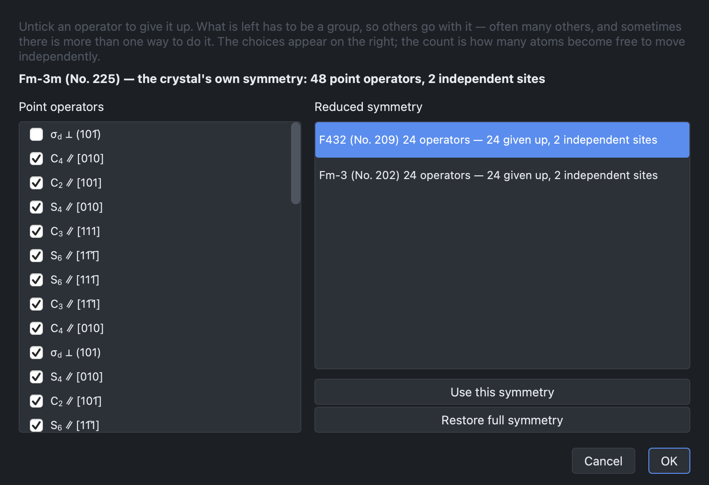

# Symmetry

## The Info panel

The symmetry reported depends on the periodicity of the structure:

| Structure | Symmetry |
| --- | --- |
| crystal (3D) | space group |
| slab (2D) | layer group |
| polymer (1D) | the repeat length only — see below |
| molecule (0D) | point group |

The panel also reports the point group, the lattice parameters, the cell volume
or area, the density and the formula. All of them are recomputed when the
structure is edited.

A polymer's symmetry is a rod group, and no rod group is named here: the
symmetry library the program uses (spglib) implements the 230 space groups and
the 80 layer groups, but not the 75 rod groups. A 1D structure is therefore
reported by its repeat length and its formula, and its symmetry elements are
listed by the point-symmetry analysis below like those of any other structure.
A deck written for a polymer uses rod group 1, with every atom listed, which is
always valid.

## Point symmetry analysis

**Cell → Point symmetry analysis** lists the symmetry elements of the structure
— rotation axes, mirror planes and inversion centres — and draws them in the
view.

The operators are named in the Schoenflies notation used in chemistry:
C2, C3, C4 and C6 for the rotation
axes, S4 and S6 for the rotoreflection axes, σ for a
mirror plane and i for a centre of inversion. The mirrors are distinguished
where the group allows it: σh perpendicular to the principal axis,
σv containing it, and σd bisecting the two-fold axes
across it. A group with no single
principal axis — the orthorhombic ones, whose three two-fold axes are
equivalent — keeps the plain σ.

The group itself is reported in the convention of its own kind: a space group or
a layer group in the Hermann–Mauguin notation, a molecular point group in the
Schoenflies one.

## Reducing the symmetry

A calculation is sometimes run in a symmetry lower than that of the ideal
structure: to allow a distortion to relax, to remove a degeneracy, or to
converge a particular magnetic state.

The **Reduce symmetry…** button of the point-symmetry panel removes
point-symmetry operators. The subgroups generated by the operators that remain
are then listed:

:::{div} crystal-shot

:::

Subgroups that cannot be written in a CRYSTAL deck are listed in grey rather
than omitted. Each candidate is verified by reconstruction: the operators are
multiplied out and the structure is rebuilt from them, so that a subgroup is
offered only if it regenerates the crystal.

The reduction applies to the structure itself. The Info panel reports it under
**Treated as**, and the decks written afterwards use it.

## Slabs

The symmetry of a slab is a layer group, one of the 80. The direction normal to
the slab is not a lattice vector, and treating the structure as
three-dimensional would count the vacuum as one.

The layer group is determined with the aperiodic direction placed along **c**,
as CRYSTAL expects, with the layer centred in the cell, and is verified by
rebuilding the slab from it before use. The deck is then written in that layer
group, with only the asymmetric unit listed; see [CRYSTAL input builder](inputs.md).

Symmetry reduction is not available for slabs, and the dialog reports the
reason: a layer group is not a space group.
