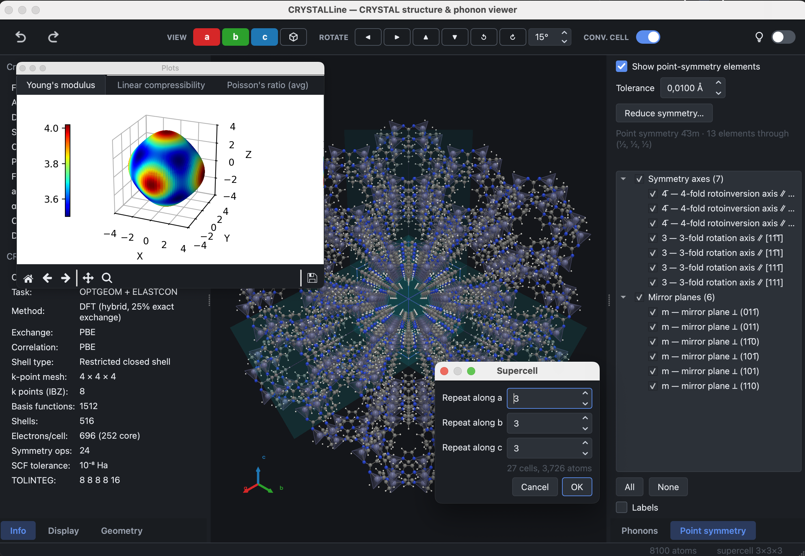

# The 3D view

The structure is drawn with PyVista and VTK. The **Display** panel contains the
settings of the drawing, grouped in sections that can be collapsed
independently.

## Drawing options

- **Atoms** — radius, opacity, colour per element, and element labels.
- **Bonds** — radius, and the tolerance used to decide which atoms are bonded.
- **Hydrogen bonds** — drawn as dashed D–H···A interactions, with their own
  geometric criteria.
- **Coordination polyhedra** — around the elements selected, in the style used
  by VESTA.
- **Cell** — the unit-cell edges and the **a**/**b**/**c** gizmo.
- **Axes**, orientation marker, background colour and projection (perspective
  or parallel).

Measurements made in the **Geometry** panel are drawn in the same view.

## Orientation

The **VIEW** group of the toolbar orients the structure along a lattice vector
and restores a view of the whole; the **ROTATE** group turns it by a fixed
step, which makes a given orientation reproducible.

Parallel projection, selected in the Display panel, is appropriate for figures:
a direction parallel to an axis remains parallel to it.

## Large structures

Large cells remain interactive; the geometry is built once and updated in
place. The supercell below contains 8,100 atoms with coordination polyhedra
drawn.

## Saving an image

**File → Export image…** writes the current view as PNG, JPEG, TIFF, SVG, PDF
or EPS, with a choice of resolution and a transparent background. The
Brillouin-zone window uses the same dialog.
